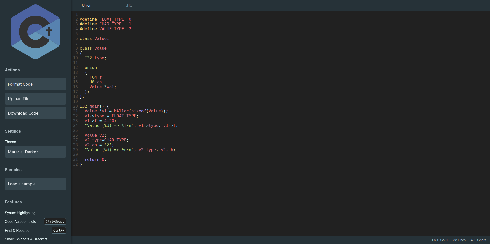

# HolyC Web Editor

A browser-based code editor for the HolyC programming language, built with modern web technologies. This project provides a simple, accessible, and feature-rich environment for anyone to write and experiment with HolyC without needing a full TempleOS installation.

**[View the Live Demo in my Website!](https://zuhaitz.dev/editor/)**

---

## Why This Editor?

The goal of this project is to lower the barrier to entry for the fascinating HolyC language. It serves as a playground for newcomers, a quick scratchpad for experienced users, and a tribute to the work of Terry A. Davis.

---

## Key Features

-  **Modern Editor Experience**: Powered by **CodeMirror**, offering a fluid and responsive coding environment.
-  **Custom Syntax Highlighting**: Full syntax highlighting for HolyC keywords, types, constants, and assembly instructions.
-  **Code Autocomplete**: Smart suggestions for keywords and handy snippets for common structures like `main()`, `if`, and `for` loops. (Trigger with `Ctrl+Space`).
-  **Multiple Themes**: Choose between **Material Darker**, **Dracula**, and **Solarized Light** to suit your preference.
-  **File Operations**: Easily **upload** your existing `.HC` files or **download** your work.
-  **Auto-Formatting**: Clean up your code with a single click using the integrated JS-Beautify.
-  **Persistent Sessions**: Your code and filename are automatically saved in the browser's local storage, so you can pick up right where you left off.
-  **Real-time Status Bar**: Keep track of your cursor position, total lines, and character count.

---

## Resources

If you want to check some documentation or learn more about HolyC/TempleOS, considering checking:

- [HolyC Documentation](https://holyc-lang.com/)
- [TempleOS Foundation](https://templeos.net/)

---

> I will be honest, you can do anything you want with this. If it helps you, it is already enough (;
